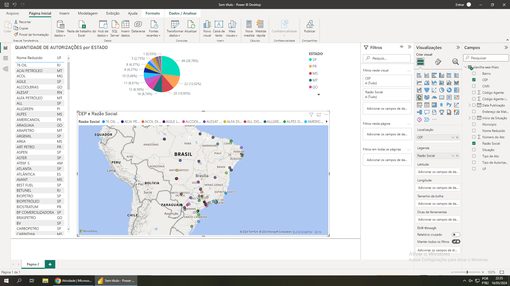

<!-- ## Ola, eu sou a Lucan Marques, muito prazer! :sparkles: -->

# Lucan Marques

Ola seja bem-vindo ao meu perfil.

Curso o 1º semestre de logípistica na Fatec e vou compartilhar um puco do meu aprendizado por aqui.

Estou entrando nesse mundo da tecnologia voltada a logística agora, não tenho quase nenhum conhecimento, mas ja sei que é esse caminho que devo percorrer.

# DASHBOARD OROVA DE INFORMÁTICA

<!-- ## Obrigado por acessar noso GitHub! :sparkles: -->

# Desenvolvimento de API

## Compartilhamento de códigos

## Resolução do Problena de Pesquisa Operacional através de programanação linear com Python:

Link do Google Colab: https://colab.research.google.com/drive/1e4U5xTcWrqJ_54rkaYLoSe7dO_n42qSt#scrollTo=2T8Fm6g3d9W5
